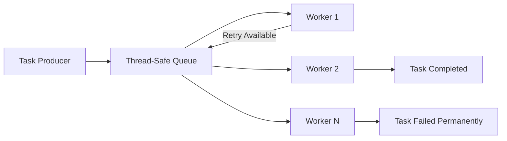

# Distributed Task Processing Simulation

A Python-based simulation of a fault-tolerant task processing workflow using the producer-consumer pattern. A producer generates jobs and places them into a thread-safe queue, while multiple worker threads process those jobs concurrently. Failed tasks are automatically retried until the configured retry threshold is reached.

This project was developed to understand practical concepts used in asynchronous and distributed job-processing systems, including producer-consumer coordination, concurrent workers, retry mechanisms, failure management, logging, and controlled application shutdown.

## System Architecture



The producer and worker processes operate through separate threads. The shared queue provides safe communication between them, allowing tasks to be created and consumed independently.

A shutdown event controls the application lifecycle. Once the configured execution time expires, the producer stops generating new tasks, while workers continue processing remaining queued tasks before the application exits.

## Key Capabilities

* Supports multiple configurable worker threads
* Allows customization of execution time and task-generation frequency
* Provides configurable failure probability
* Automatically retries unsuccessful task attempts
* Marks tasks as permanently failed after reaching the retry limit
* Produces timestamped logs containing worker/thread information
* Performs an orderly shutdown after outstanding tasks are processed
* Includes unit tests covering successful processing, retries, permanent failures, and invalid configurations

## Technologies Used

* Python 3
* `threading`
* `queue`
* `logging`
* `pytest`

## Running the Project

Clone the repository and move into the project directory:

```bash
git clone https://github.com/swaroopnaidu143/System_simulation
cd system-simulation
```

Start the simulation with the default configuration:

```bash
python distributed_simulation.py
```

### Running with Custom Configuration

The simulation parameters can be changed through command-line arguments:

```bash
python distributed_simulation.py --workers 4 --duration 15 --max-retries 3 --failure-rate 0.35
```

For information about all available command-line options:

```bash
python distributed_simulation.py --help
```

## Running the Tests

Install the development dependencies:

```bash
python -m pip install -r requirements-dev.txt
```

Then execute the test suite:

```bash
python -m pytest
```

## Retry and Failure Processing

Every newly created task starts with a retry counter of zero.

When processing fails, the task's retry counter is increased. If the number of attempts is still within the configured retry policy, the task is placed back into the queue for another attempt.

If the maximum retry threshold has been reached, the task is considered permanently unsuccessful. It is logged as failed and is not added to the queue again.

This approach represents a basic transient-failure recovery mechanism commonly used in asynchronous processing systems.

## Connection to Real Distributed Systems

Although this implementation executes on a single machine and stores its queue in memory, it demonstrates several patterns that are commonly found in production distributed architectures.

These include:

* Producer-consumer workflows
* Shared work queues
* Multiple competing workers
* Retry policies for temporary failures
* Failure reporting and visibility
* Configurable system behavior
* Graceful service shutdown

In a production environment, the in-memory queue and local threads would typically be replaced or supplemented by distributed messaging infrastructure and independently running worker services.

Additional production requirements could include durable message storage, idempotent task processing, dead-letter queues, authentication, monitoring metrics, distributed tracing, persistent state, horizontal scaling, and recovery mechanisms for machine or service failures.

## Current Limitations

The current implementation has several intentional limitations:

* Task information exists only in memory and is lost when the application stops.
* Task failures are simulated using randomly generated failure conditions.
* Logs are written locally instead of being sent to an external monitoring system.
* The simulation does not provide multi-machine or container-based deployment.
* There is no external message broker or persistent task storage.

## Possible Future Improvements

The project can be extended with additional distributed-system capabilities, such as:

* Adding unique identifiers to individual tasks
* Implementing a dead-letter queue for permanently failed jobs
* Collecting processing and failure metrics
* Adding a persistent task store
* Integrating Kafka or RabbitMQ as an external message broker
* Adding distributed monitoring and tracing
* Supporting multiple independent worker services
* Implementing stronger recovery and fault-tolerance mechanisms

## Project Objective

The main objective of this project is to provide a practical implementation of concurrent task processing and demonstrate how fundamental producer-consumer and fault-tolerance concepts can be applied to asynchronous job-processing architectures.
